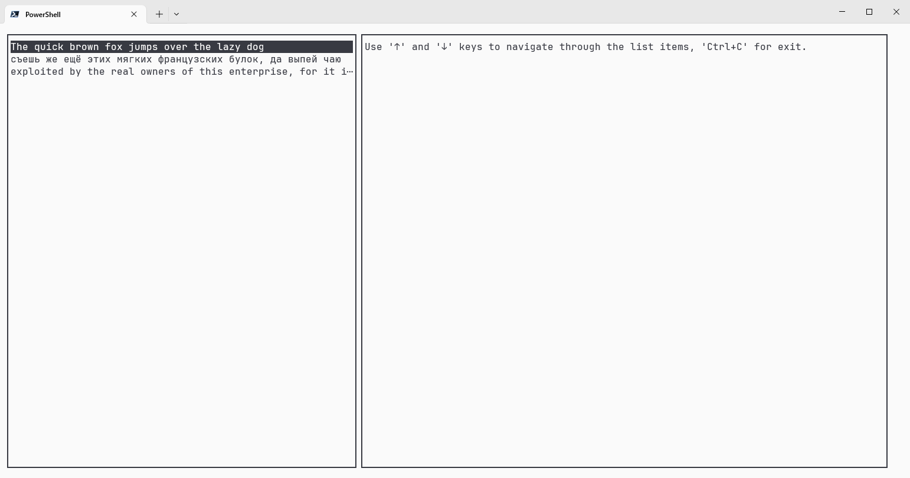

# Thuja

[](https://www.nuget.org/packages/Thuja.Tutu)

<p align="center">
 
</p>

Thuja (_pronounce:_ /ˈθuː.jə/) is a minimalistic [F#](https://fsharp.org) library to build terminal user interfaces. It's inspired by [Elm](https://elm-lang.org/) and based on [Tutu](https://github.com/lillo42/tutu/) as a cross-term backend implementation.

## Prerequisites

- [.NET SDK](https://dotnet.microsoft.com/) to work with F# files and dependencies.

## Usage

_See the [examples directory](sample/)._

```fsharp
// model
let selected = 0

// view
let view selected =
  columns [ Fraction 40; Fraction 60 ] [
    panel [] [ 
      list [
        "The quick brown fox jumps over the lazy dog"
        "съешь же ещё этих мягких французских булок, да выпей чаю"
        "exploited by the real owners of this enterprise, for it is they who take advantage of the needs of the poor" 
      ] selected
    ]
    panel [] [
      text [] "Use '↑' and '↓' keys to navigate through the list items, 'Ctrl+C' for exit."
    ]
  ]

// update
let update selected event  =
  let length = 2
  match event with
  | Char 'c', KeyModifiers.Ctrl -> selected, Program.exit()
  | Down, _ -> Math.Min(length, selected + 1), Cmd.none
  | Up, _ -> Math.Max(0, selected - 1), Cmd.none
  | _ -> selected, Cmd.none

// program
Program.make selected view update
|> Program.withKeyBindings Cmd.ofMsg
|> Program.withTutuBackend
|> Program.run
```

 

## Documentation

See the [Wiki](https://github.com/HenryKovalevsky/Thuja/wiki) for full documentation, details and other information.

## Todo (future features list)

- improve documentation;
- make comprehensive user input handling:
    - extend keyboard input;
    - mouse input?
- implement configurable subscriptions;
- add different control elements:
    - markup;
    - text input?;
    - buttons?;
    - ...
- handle terminal resizing;
- add tests;
- add debug options;
- ...